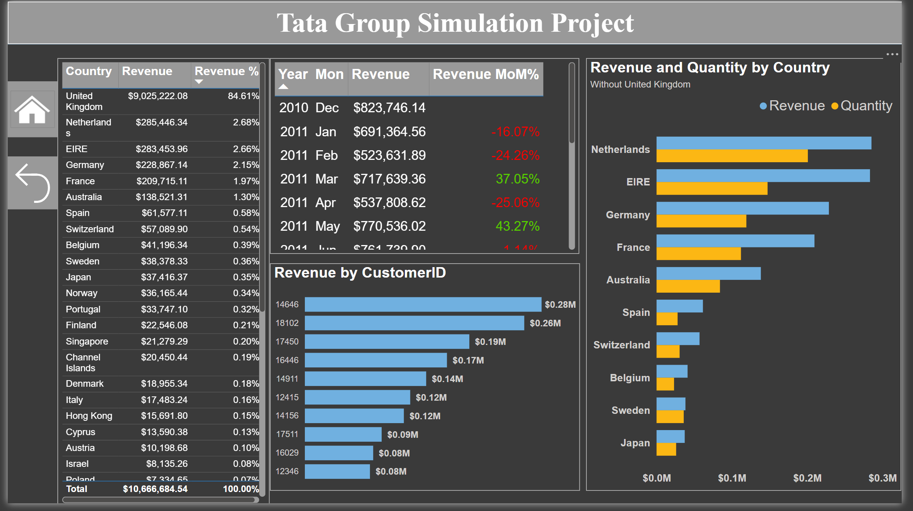

# Tata Group Simulation Project
## Problem Statement:
The business aims to analyze its sales data to uncover insights that drive strategic decision-making. Specifically, we seek to address the following:

- Revenue Trends: Understanding monthly and seasonal revenue fluctuations to identify growth opportunities and optimize sales strategies.
- Country-wise Revenue Contribution: Evaluating the average revenue generated by each country to pinpoint high-performing and underperforming regions.
- Customer Behavior: Analyzing customer purchasing patterns to improve retention and personalize marketing efforts.
- Campaign and Product Effectiveness: Measuring the impact of marketing campaigns and identifying top-performing products to enhance ROI and product positioning.

The goal is to provide actionable insights to the CEO and CMO, enabling data-driven strategies for revenue growth, market expansion, and operational efficiency.

## Executive Summary
A comprehensive analysis was conducted on 541k+ purchase transactions, addressing data quality issues like missing values, negative quantities, and pricing errors to create a reliable dataset of 540k records. Key findings revealed that around 50% of transactions were from guest accounts, contributing 16% of total revenue, signaling an opportunity to convert one-time buyers into loyal customers. Q4 was the strongest-performing quarter, with November leading in revenue ($1.5M). Six countries, with the Netherlands, Ireland, and Germany being the top contributors, generated 95% of total sales. Seasonal trends and regional sales were visualized in an interactive Power BI dashboard, identifying peak sales periods and high-demand products. These insights highlight opportunities for strategic customer retention, market-specific growth strategies, and optimized resource allocation during high-demand periods.

## Dashboard Snapshots

### Home Page
<!--  -->

### Customer Demographics
<!--  -->

## Data Quality Issues and Cleaning Approaches
### Missing Values
- **Description**: 1,454 records with missing product descriptions.
- **CustomerID**: 135,080 records with missing CustomerID values (~50% of the dataset).

### Negative Quantities
- **Details**: 10,624 records with negative quantities.

### Price Issues
- **Details**: 2,517 records with zero or negative prices.

## Modifications Applied
- Added a new column, **'Transaction_Type'**, to categorize transactions as Returns or Purchases.
- Removed rows with missing product descriptions, zero or negative prices & negative quantities.
- Added a **'Total_Value'** column calculated as `Quantity * UnitPrice`.

## Dataset Reduction
- Original rows: **541,909**
- Cleaned rows: **540,453**
- The cleaning process preserved most of the data while addressing problematic entries.

## Additional Observations
- Missing CustomerID values are likely due to guest checkouts.

## Tools and Skills Used
- **Tools**: Python (Pandas, NumPy), Excel, PowerBI
- **Skills**: Data Cleaning, Data Analysis, Data Validation, Business Insights

## Insights and Recommendations

**Guest vs Customer Transactions**

*Insights*:
- Approximately 50% of transactions were made by guest accounts, which represents a significant portion of the customer base.
- These guest transactions contribute 16% of the total revenue, highlighting their importance despite not being tied to repeat customers.
- The current customer base is predominantly one-time buyers, suggesting a missed opportunity in fostering customer loyalty and retention.

*Recommendations*:
- Loyalty Program Implementation: Develop and promote a loyalty program to incentivize guest users to create accounts, offering them benefits such as discounts or rewards for repeat purchases.
- Targeted Retention Campaigns: Leverage customer data to create personalized marketing campaigns aimed at converting one-time buyers into recurring customers.
- Account Registration Incentives: Introduce time-limited offers or discounts for customers who sign up for an account during checkout to encourage the creation of a more stable customer base.
- Guest User Follow-Up: Implement a follow-up strategy for guest users, such as email reminders or special offers to encourage them to return and make another purchase, eventually converting them to regular customers.

**Revenue Trends**

*Insights*:
- Peak Performance: November was the strongest month with revenue of $1.5M, followed by October at $1.15M
- Q4 Dominance: The last quarter showed exceptional performance
- Seasonal Pattern: Observed lower revenue in early Q1 (February: $523K), likely due to post holiday season slow down
- Growth Trajectory: Revenue showed an upward trend from September through November

*Recommendation*: 
- Leverage Q4 Success: Capitalize on the strong performance in Q4 by developing targeted marketing campaigns and special offers to maintain momentum in future Q4 periods.
- Forecast and Plan for Peak Months: Given the strong performance in November, ensure inventory and marketing efforts are optimized in anticipation of future peak months, particularly around the holiday season.
- Sustain Growth Trajectory: Continue analyzing the factors driving the revenue increase from September through November and replicate strategies that worked, while maintaining flexibility for adjusting as per market conditions.

**Revenue & Product Demand by Country** 

*(UK was excluded as per the management request since UK is already a well-performing market, and the focus is on improving other regions)*

*Insights*:
- Netherlands leads with $285K in revenue (200,937 units sold)
- Ireland follows closely at $283K (147,447 units)
- Germany ranks third with $229K (119,263 units)
- France shows strong performance with $210K (112,104 units)

*Recommendation*: 
- Deepen Market Penetration in the Netherlands: Given the Netherlands leads in both revenue and units sold, focus on strengthening the brand's presence by increasing marketing efforts, launching targeted promotions, and expanding distribution channels to further capitalize on this high-performing market.
- Optimize Revenue Per Unit in Ireland: Although Ireland's revenue is comparable to the Netherlands, its unit sales are significantly lower. Investigate pricing strategies, product mix, or customer preferences to increase the average revenue per unit, improving profitability.
- Benchmark and Replicate Success Across Markets: Analyze what drives the Netherlands’ market success and replicate these strategies in Ireland, Germany, and France, tailoring them to each region’s unique cultural and economic factors.
- Monitor and Prioritize Investments: Focus resources on high-performing regions like the Netherlands and Ireland for short-term revenue growth while investing in Germany and France for long-term market expansion and stability.

**Top Customers**

*Insights*:
- Customer 14646 is our highest value customer ($280K in revenue)
- Customer 18102 follows at $260K
- Customer 17450 ranks third with $195K

*Recommendation*: 
- Strengthen Relationships with Top Customers: Implement a personalized account management strategy for these high-value customers to further nurture the relationship. Offer tailored incentives, such as exclusive discounts, early access to new products, or dedicated support, to encourage continued business and loyalty.
- Priority Support and Engagement: Provide premium customer service and exclusive engagement opportunities, such as invitations to events or product previews, to demonstrate appreciation and solidify long-term partnerships.
- Expand the Customer Base with Similar Profiles: Study the characteristics and purchasing behaviors of these top customers to identify and target similar potential customers through focused marketing campaigns and outreach efforts.

